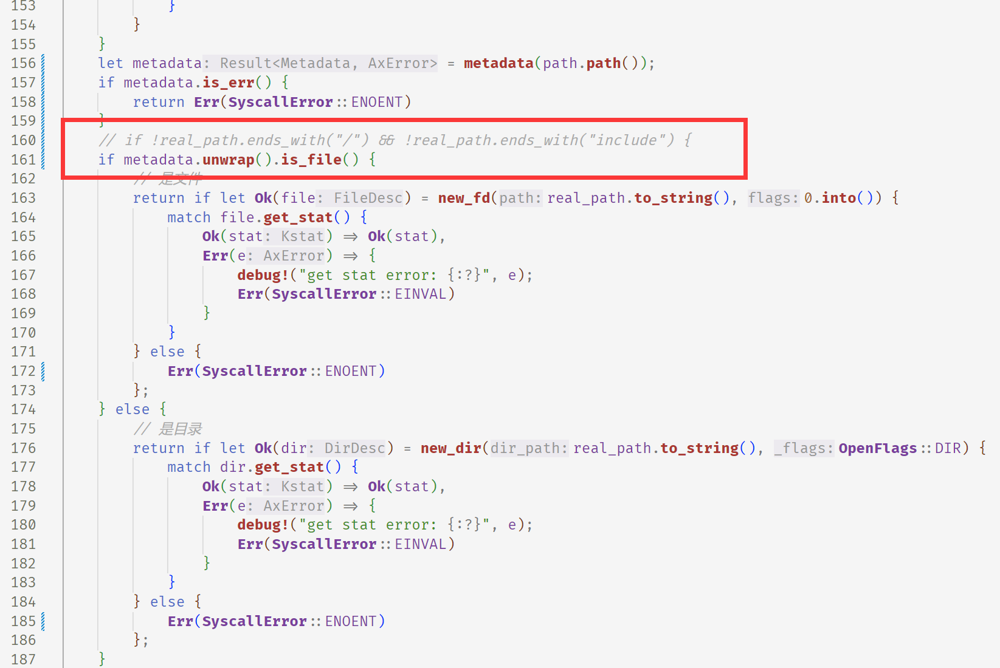

## 实验

### 实验3.1

结果

make run 和 本机strace结果图

从图中看出系统调用的返回值不同，在代码中找到返回值的位置。

在`ulib/axstarry/syscall_fs/src/imp/stat.rs/syscall_fstatat`，调用函数`get_stat_in_fs`，该函数返回值不符合预期，进入函数中修改。

修改代码位置

完善`syscall_renameat2`

### 实验3.2

结果

左边为内核的系统调用，右上是`busybox abc bin1`右下是`busybox bin1 bin`

`bin`为文件夹，`bin1`不在当前目录下，对比发现，内核将`bin`作为了一个新的文件名，而不是文件夹，说明获取`bin`的信息时出现错误

查看代码和syscall文档可以知道，通过FSTATAT，得到一个`stat`的信息，FSTATAT又通过调用`get_stat_in_fs`得到。

最终找到了问题所在，在`ulib/axstarry/syscall/src/ctype/mount.rs`。

代码中判断是否是文件不正确，进行改写。

## 思考题

### 思考题1.1

如图所示

### 思考题1.2：如果忘记 make clean 会发生什么？

如果忘记`make clean`，`make run`时修改后的代码并没有生效

### 思考题2

选择内核为umi

直接搜索`_start`，在mizu\kernel\src\rxx.rs 中找到 ——start

阅读代码，会跳转到同一文件中的__rt_init，进入run_art函数中

在run——art中创建变量runner，调用main函数

搜索main，在mizu\kernel\src\main.rs中

main函数的最后调用testall

最后进入testall函数，至此找到了启动后会运行的测例，如下

简要分析代码后，知道主要是busybox、copy-file-range、libc、lua、iperf、cyclictest、unixbench、lmbench、iozone测例。

### 思考题3.1 

**为什么要在开头结尾各输出一句，会不会太过重复？（提示：考虑执行出错的情况，或者 sys_exit ）**

开头一句确定syscall参数，结尾确定syscall返回值，用于判断syscall执行情况，如果是sys_exit这种情况则只有开头的一句输出，方便检测运行正确性

### 思考题3.2 

**为什么要结尾还要输出一遍 syscall 的完整参数，只输出返回值行不行？（提示：考虑像 sys_yield 这样的 syscall）**

开始和结尾的两条输出可以看作一对括号

**TODO**

~~不是太懂为什么~~
